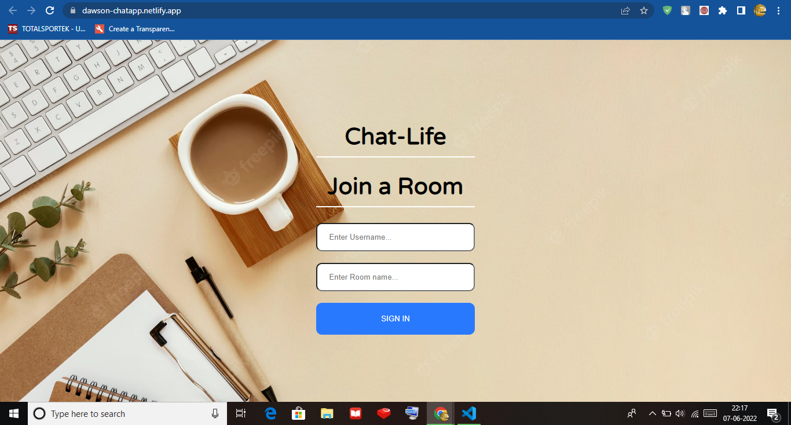
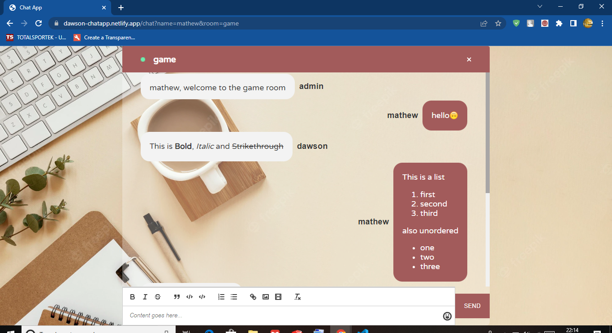
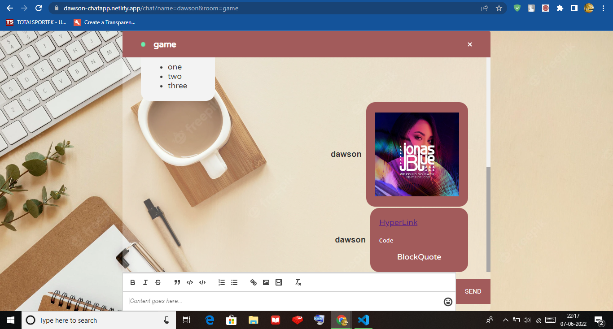

# Chat Application

You can Use the Chat Application by visiting : https://dawson-chatapp.netlify.app

In order to use the app do the following:
1) Open the Website

2) Enter a username and the name of any room you want to join(eg. play, game)
3) Wait for the message from the admin, after which you have successfully joined the room.
4) Open the samewebsite from another device or just open it another tab in the browser.
5) Enter a different username but the same name of the room(eg. game if previously used game).
6) Now both users have joined the same room and can now chat, the room can have any number of users.
7) Double Click send to send the messages.
8) You can select the text that you want to format and then click on bold, italic, strikethrough etc.
9) You can also send images, emojis.
10) To use mention just type @ in the editor and you will be prompted with a list of all users in the room to mention.

